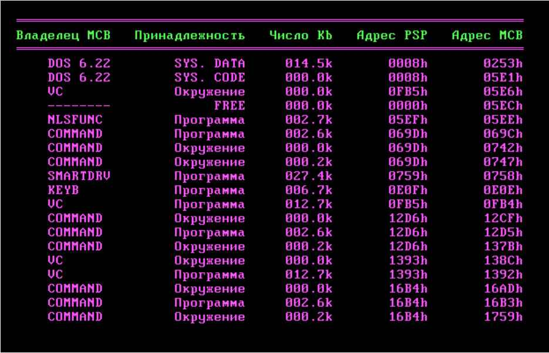

# Project Summary in Assembly for MS-DOS

## Description

This project includes several programs written in assembly language for the MS-DOS operating system. Each program implements different functionalities and demonstrates the capabilities of working with system resources at a low level. The main areas covered by the project are:

1. **Timer Setup**:
   - The program allows users to set a timer with the ability to configure the time via command-line parameters. It displays the current time and generates an audible alert when the set time expires.

2. **Memory Management**:
   - This program displays information about memory segments (MCB - Memory Control Block), including their sizes and attributes. It uses DOS interrupts to obtain a list of memory segments and their characteristics, and it displays this information on the screen in a tabular format.

3. **Network Protocols**:
   - The program implements client-server interaction using IPX and SPX protocols, allowing file transfer between network nodes. It checks for installed drivers, manages data transmission, and handles potential errors.

## Main Components

- **Segments and Variables**: The programs use code and data segments, as well as arrays and strings to store information and messages for the user.

- **Procedures and Handlers**: Each program includes several procedures responsible for different tasks: initialization, input handling, data transmission, interrupt management, and information display.

- **Error Handling**: All programs implement mechanisms for tracking and handling errors, ensuring reliable operation.

## Conclusion

This project serves as an example of applying assembly language to solve practical tasks related to time management, memory, and network interactions. It provides an opportunity to explore low-level operations and the principles of the MS-DOS operating system.

